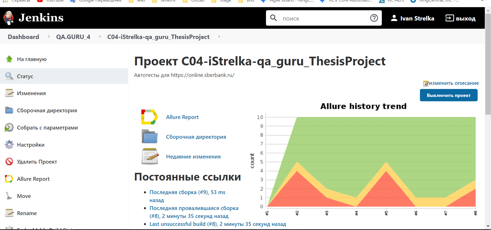
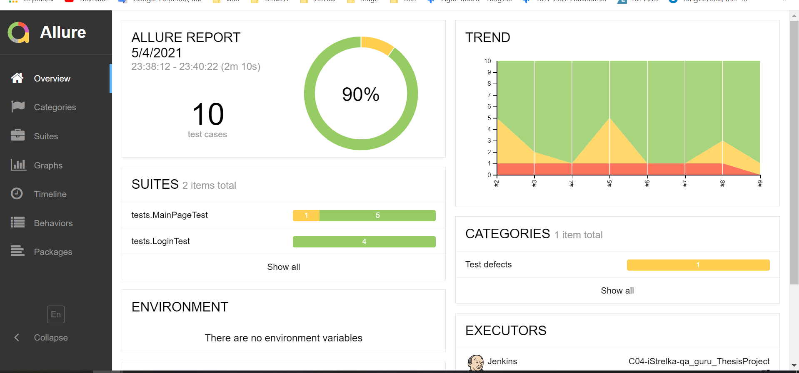
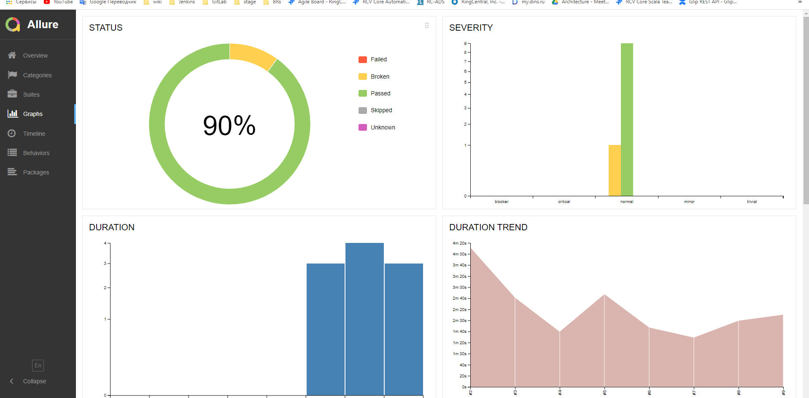
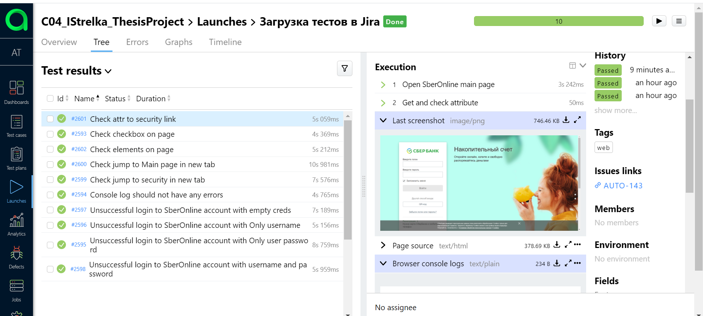
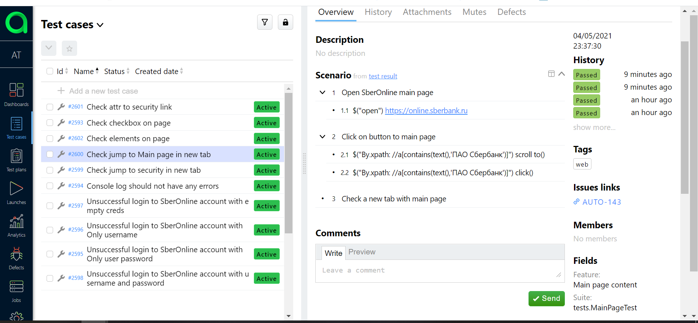
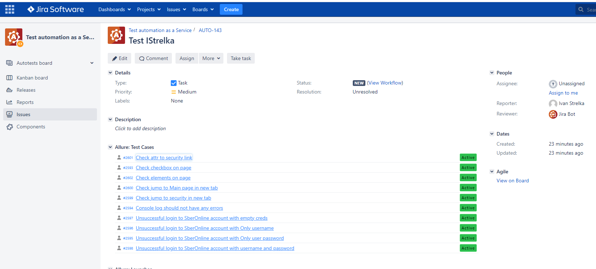

# Thesis Project - QA_GURU 4 Stream

# Personal account autotests https://online.sberbank.ru/

## Scope:
### UI tests:

- [X]  Main page layout
- [X] Log in via UI
- [X] Authorization with various invalid passwords
- [X] Checking UI elements

## Technology Stack:

IntelliJ IDEA, Java, Selenide, Gradle, JUnit5, Allure SE, Allure TestOps, Github, Jira.

## Infrastructure:

Jenkins, Selenoid,Telegram (reports),

## Job in Jenkins to run parameterized tests on a schedule

## Video about passing autotests

## Create an Allure report

## Create an Allure TestOps EE

## Jira integration

## Added bot for Telegram notifications

### Сontact with me

