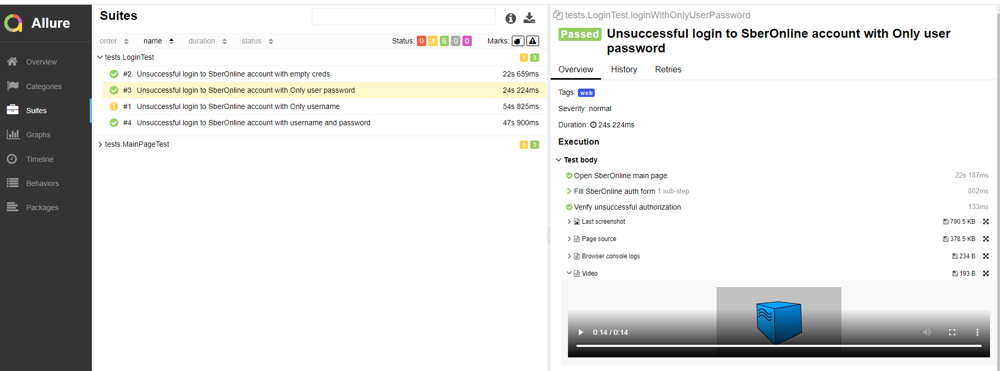
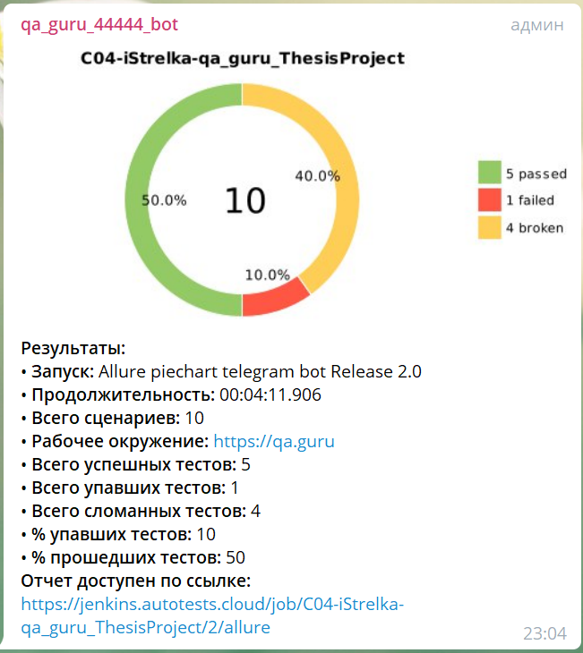

# Thesis Project - Дипломный проект

# Автотесты личного кабинета https://online.sberbank.ru/

## Stack:

!
IntelliJ IDEA, Java, Selenide, Selenoid, Gradle, JUnit5, Allure SE, Allure TestOps, Github, Jenkins, Rest-Assured,
Telegram (reports), Jira.

## Infrastructure:

## Видео о прохождении автотестов

## Создан отчёт Allure

## Добавлен бот для уведомления в Telegram

